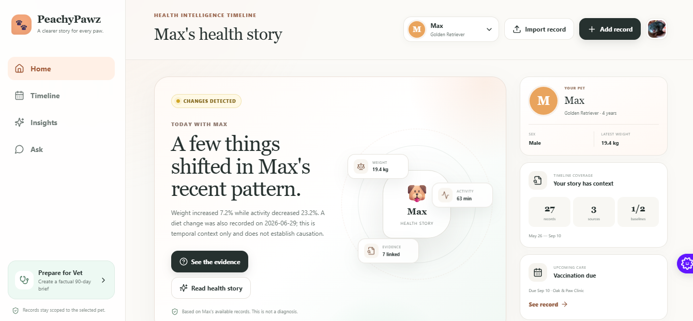
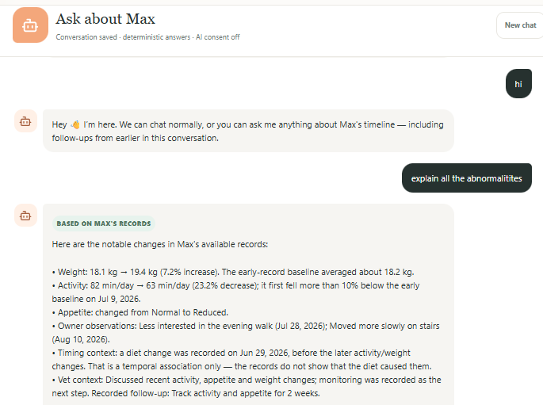

# 🍑 PeachyPawz

**Live Demo:** [https://peachypawz.vercel.app](https://peachypawz.vercel.app/)

## 🐾 What is PeachyPawz?

PeachyPawz is an AI-powered, longitudinal pet-health intelligence platform. It acts as a smart timeline that helps pet parents understand what happened, what changed, what patterns exist, and what may need attention — with evidence behind important conclusions.

## ⚠️ The Problem We're Solving

Pet-health information is highly fragmented across vet reports, PDFs, vaccination cards, weight measurements, symptoms, diet changes, and owner observations. A pet parent can have dozens of records and still struggle to answer a simple question: **"What actually changed?"**

Most record systems solve **storage**. PeachyPawz focuses on **understanding change over time**.

## ✨ Features

- **Longitudinal Health Timeline:** A structured history of your pet's health events (Weight, Activity, Symptoms, Diet changes, Vet visits, etc.).
- **Data Extraction via PC Extension:** The "Ask Peachy" desktop browser companion allows you to effortlessly extract necessary text and data directly from web pages into your pet's timeline without copy-pasting.
- **Mobile Peachy Share Integration:** On Android, PeachyPawz acts as a native share target. You can seamlessly send PDFs, images, URLs, and text directly from other apps straight into PeachyPawz for AI extraction.
- **Personal Pet Baseline:** Deterministic analytics identify changes based on your pet's unique history.
- **Evidence-Backed Insights:** Understand *why* an insight was generated with transparent evidence bundles.
- **Vet Mode:** Prepare for veterinary visits with recent changes, relevant history, and suggested questions.
- **Multi-Pet Support:** Isolated profiles to prevent cross-pet data contamination.

## 🧠 How AI is Used (And Why)

The AI in PeachyPawz operates strictly as a **language layer over structured evidence**. 

- **Why:** LLMs are prone to hallucinating medical advice. Instead of having the AI invent conclusions, PeachyPawz relies on deterministic change detection to identify anomalies (e.g., a 10% drop in weight). 
- **How:** The AI is handed these deterministic insights and asked to explain them in a cautious, understandable narrative. 
- **Conversational Memory:** AI provides timeline-aware chat, resolving natural language queries by grounding answers against fresh timeline records—never treating past chat logs as medical evidence.

## 🛠 Tech Stack

- **Framework:** Next.js (App Router)
- **Language:** TypeScript
- **Styling:** Tailwind CSS
- **Authentication:** NextAuth (Google OAuth)
- **AI Integrations:** Groq, OpenRouter, OpenAI (Configurable provider abstraction)
- **Deployment:** Vercel

## 🚀 How to Run It

1. **Clone the repository**
   `ash
   git clone https://github.com/smsolutionsva-byte/PeachyPawz.git
   cd PeachyPawz
   `
2. **Install dependencies**
   `ash
   npm install
   `
3. **Configure environment variables**
   Copy .env.example to .env.local and add your keys:
   `nv
   AUTH_SECRET=your_generated_auth_secret
   AUTH_GOOGLE_ID=your_google_client_id
   AUTH_GOOGLE_SECRET=your_google_client_secret
   
   AI_PROVIDER=groq
   GROQ_API_KEY=your_groq_api_key
   `
4. **Start the development server**
   `ash
   npm run dev
   `

## 📸 Demo Screenshots

## 🏗 Architecture Overview

`	ext
                  DATA CAPTURE
Manual entry | Document upload | Peachy Share (Mobile) | Ask Peachy (Desktop)
                       ↓
                 Review / Inbox
                       ↓
              Normalized Timeline
                       ↓
               Analytics Engine
                       ↓
               Evidence Builder
                       ↓
                  AI Service
                       ↓
    Health Story | Ask Peachy Chat | Vet Brief
`

## 🔮 Future Improvements

- **Database Persistence (MongoDB):** Transitioning from local browser/session storage to a production-ready MongoDB and private object storage architecture. This will allow user accounts to persistently retain context, uploaded documents, and timeline data across all devices.
- **Native Applications:** Full native Android and iOS applications leveraging platform features like iOS Share Extensions, push notifications, and background syncing.
- **Connected Health Sources:** Direct API integrations with veterinary portals and pet wearables.

