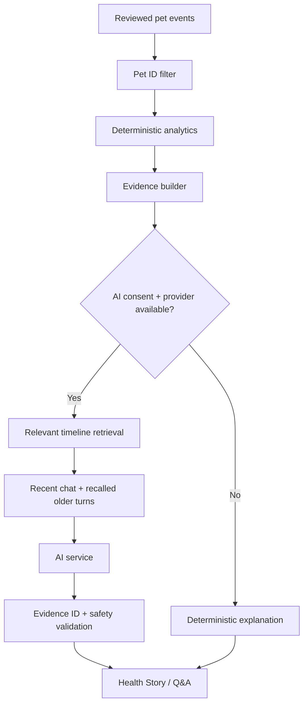

# 🐾 PeachyPawz

### A clearer story for every paw.

**PeachyPawz** is a mobile-first AI health-intelligence timeline built for the **PetOlife AI Code-a-Thon**.

**Live demo:** https://peachypawz.vercel.app  
**Repository:** https://github.com/smsolutionsva-byte/PeachyPawz

> **North star:** Raw Pet Data → Meaningful Health Story → Personalized Insight → Responsible Action

PeachyPawz is intentionally **not** a veterinary diagnosis engine and not a CRUD folder with a chatbot attached. Its core job is to help a pet parent understand longitudinal change:

- **What happened?**
- **What changed?**
- **How different is this from my pet's own baseline?**
- **What other events occurred around the same time?**
- **Why am I seeing this insight?**
- **What is a responsible next step?**

---

## 1. The problem

Pet-health information is fragmented across vet reports, PDFs, vaccination cards, measurements, medication notes, symptoms, diet changes and owner observations. A pet parent can have dozens of records and still struggle to answer a simple question:

> **“What actually changed?”**

Most record systems solve **storage**. PeachyPawz focuses on **understanding change over time**.

```text
Fragmented records
      ↓
Reviewed structured timeline
      ↓
Personal baseline
      ↓
Deterministic change + pattern detection
      ↓
Evidence bundle
      ↓
Optional AI explanation / conversation
      ↓
Responsible action / Vet Brief
```

The **timeline is the source of truth**. The LLM is a language layer over structured evidence.

---

## 2. First-run experience

A real user never lands inside fabricated Max data.

```text
Google sign-in
      ↓
Create pet
      ↓
Name + a few optional details
      ↓
Choose whether AI may process submitted records
      ↓
Upload document / add manually / start empty
      ↓
Health timeline begins
```

Synthetic Max/Luna records exist only behind a clearly labelled **hackathon demo** action.

---

## 3. What is implemented

### Product / UX

- Google OAuth sign-in with Auth.js
- Mobile-first responsive experience with bottom navigation
- First-run pet onboarding
- Empty timeline with zero fabricated records
- Multi-pet household switching and **Add another pet**
- Pet-scoped timelines and chat memory
- Timeline search and event filters
- Manual entry for weight, activity, appetite, symptoms, medication, visits and notes
- Correct / delete reviewed records; analytics update immediately
- Source/provenance and review-state display
- “What Changed?” cards
- Personal baseline view
- Explainable “Why am I seeing this?” evidence drawer
- AI Health Story
- Conversational **Ask about your pet** experience
- Persistent per-pet conversation memory in the prototype
- Prepare for Vet brief
- Upcoming-care visibility from recorded vaccination/follow-up data
- Reduced-motion support and mobile touch-target hardening

### Analytics / intelligence

- Deterministic percentage change
- Personal-baseline calculation with insufficient/emerging/reliable states
- Multi-metric pattern detection
- Temporal ordering
- Missing data stays missing
- Weight unit normalization (`lb` → canonical `kg`) before comparisons
- Evidence IDs attached to insights
- Insights regenerate from current reviewed records rather than being permanent conclusions

### Document workflow

- PDF, TXT, JPG and PNG upload
- Text extraction / heuristic parsing where possible
- Optional AI vision extraction when configured and consented
- Review-before-save
- Wrong-pet warning
- Exact-file duplicate warning using SHA-256 hash
- Searchable reviewed document memory retained in the pet timeline
- Imported data stores provenance, confidence and source-document linkage

### AI / conversation

- Provider abstraction: **Groq**, **OpenRouter**, or **OpenAI**
- Server-side keys only
- AI processing requires user consent in the prototype
- Natural small talk does not retrieve pet health records
- Pet questions use fresh timeline retrieval
- Recent chat context + relevant older-turn recall
- Old conversation may resolve references, but **chat memory is never medical evidence**
- Pet-specific claims are re-grounded against current timeline records
- Deterministic fallback if the AI provider fails or is disabled
- Safety filtering for diagnosis/medication-change language
- Emergency-language guard before optional LLM calls

---

## 4. The differentiator

Current pet-health software already offers combinations of medical records, reminders, pet-parent apps, AI summaries and chat. PeachyPawz does not position “AI” itself as the innovation.

Its differentiation is:

> **Understanding longitudinal change against this pet's own history — and showing the evidence behind every important interpretation.**

The user can move through progressive disclosure:

```text
Simple insight
   ↓
Why?
   ↓
Evidence + calculation
   ↓
Original timeline records
```

See [`docs/COMPETITIVE_RESEARCH.md`](docs/COMPETITIVE_RESEARCH.md).

---

## 5. AI architecture



### Deterministic code owns

- arithmetic
- percentages
- unit normalization
- event ordering
- personal-baseline calculations
- evidence IDs
- record/pet selection

### AI is used for

- human-readable explanation
- longitudinal storytelling
- conversational interaction
- optional image-document extraction

This prevents the model from becoming the source of truth.

More detail: [`docs/AI_APPROACH.md`](docs/AI_APPROACH.md).

---

## 6. Conversational memory without losing evidence

PeachyPawz is designed to feel conversational rather than like a query box.

```text
Current message
    +
recent turns
    +
relevant older turns
    +
freshly retrieved timeline / document records
    ↓
answer
```

Example:

```text
User: Explain all unusual changes.
AI:   Weight rose while activity declined ...

User: Which happened first?
AI:   [uses conversational reference + timeline ordering]

... many turns later ...

User: What did that old vet report say about follow-up?
AI:   [recalls the topic, then retrieves the reviewed document record again]
```

**Important trust rule:** remembered assistant text can help identify what “that” refers to, but it cannot establish a health fact. The current timeline must support the claim.

---

## 7. Responsible medical language

PeachyPawz does not diagnose or prescribe.

It prefers language such as:

- “was observed”
- “occurred during the same period”
- “may be worth monitoring”
- “consider discussing persistent changes with a veterinarian”

It avoids unsupported:

- “caused”
- “definitely”
- medication/dosage changes
- diagnostic claims
- false reassurance

Potentially urgent user-described situations are intercepted before normal AI narration and surfaced as short guidance to seek prompt veterinary/emergency veterinary attention.

See [`docs/SECURITY_PRIVACY_SAFETY.md`](docs/SECURITY_PRIVACY_SAFETY.md).

---

## 8. Five-minute evaluator demo

1. Open the live product and sign in with Google.
2. Show that a new pet starts with **zero health records**.
3. Create a pet or explicitly load the synthetic Max demo.
4. Open **What Changed?**.
5. Tap **Why am I seeing this?** and show evidence + deterministic calculation.
6. Ask: **“Explain all unusual changes.”**
7. Follow with: **“Which happened first?”** to demonstrate conversational context.
8. Upload the bundled vet report.
9. Show wrong-pet / review-before-save behavior and approve the record.
10. Correct a timeline record and show the insight recalculate.
11. Generate **Prepare for Vet**.
12. Close with the native Android/iOS roadmap.

Detailed narration: [`docs/DEMO_SCRIPT.md`](docs/DEMO_SCRIPT.md).

---

## 9. Demo data

The optional synthetic story contains approximately 90 days of records for **Max**, a Golden Retriever:

```text
Stable period
   ↓
Diet change
   ↓
Activity decline
   ↓
Weight increase
   ↓
Vet visit / monitoring follow-up
```

The evaluator can see PeachyPawz discover this story from the timeline rather than being handed a mystery health score.

Bundled sample:

```text
public/demo/Max_Vet_Report.pdf
public/demo/Max_Vet_Report.txt
```

---

## 10. Stack

| Layer | MVP choice |
|---|---|
| Frontend | Next.js 15, React 19, TypeScript |
| Styling | Tailwind pipeline + custom mobile-first CSS |
| Auth | Auth.js / Google OAuth |
| Analytics | Deterministic TypeScript domain layer |
| AI | Provider abstraction: Groq / OpenRouter / OpenAI |
| Validation | Zod |
| PDF text | `pdf-parse` |
| Prototype persistence | Browser localStorage, scoped by signed-in user + pet |
| Deployment | Vercel |
| Production persistence plan | MongoDB + private object storage |

---

## 11. Local setup

Requirements: Node.js 20+.

```bash
npm install
cp .env.example .env.local
npm exec auth secret
npm run dev
```

Open http://localhost:3000.

### Google OAuth

Create a Google OAuth **Web application** and configure:

```text
Authorized origin:
http://localhost:3000

Authorized redirect URI:
http://localhost:3000/api/auth/callback/google
```

Then set:

```env
AUTH_SECRET=...
AUTH_GOOGLE_ID=...
AUTH_GOOGLE_SECRET=...
```

---

## 12. Free/low-cost AI setup: Groq

Groq is the recommended code-a-thon configuration.

```env
AI_PROVIDER=groq
GROQ_API_KEY=your_server_side_key
GROQ_MODEL=llama-3.3-70b-versatile
GROQ_VISION_MODEL=qwen/qwen3.6-27b
```

Never prefix a provider key with `NEXT_PUBLIC_`.

Alternative providers:

```env
AI_PROVIDER=openrouter
OPENROUTER_API_KEY=...
OPENROUTER_MODEL=openrouter/free
```

or

```env
AI_PROVIDER=openai
OPENAI_API_KEY=...
OPENAI_MODEL=gpt-5
```

If the provider is absent, disabled, rate-limited or unavailable, the core timeline and deterministic analytics still function.

See [`docs/AI_PROVIDER_SETUP.md`](docs/AI_PROVIDER_SETUP.md).

---

## 13. Deploy to Vercel

The production demo uses Vercel.

Set these environment variables in the Vercel project:

```text
AUTH_SECRET
AUTH_GOOGLE_ID
AUTH_GOOGLE_SECRET
AI_PROVIDER
GROQ_API_KEY        # if using Groq
GROQ_MODEL          # optional override
GROQ_VISION_MODEL   # optional override
```

Then add the exact production Google OAuth callback:

```text
https://peachypawz.vercel.app/api/auth/callback/google
```

Full guide: [`docs/DEPLOYMENT.md`](docs/DEPLOYMENT.md).

---

## 14. Prototype limitation: persistence

Authentication is real, but health data in this hackathon build is stored in **browser localStorage scoped to the signed-in account**.

Why this MVP choice:

- removes a database dependency from the evaluator path
- keeps the demo resilient
- makes the source-of-truth behavior easy to inspect

What it does **not** provide:

- cross-device sync
- server-side record durability
- true family sharing
- production audit retention

Production migration:

```text
Auth session
  ↓
owner/pet authorization
  ↓
MongoDB health-event store
  +
private object storage for documents
  +
queue for extraction / insight regeneration
```

The repository does not pretend localStorage is production healthcare infrastructure.

---

## 15. Repository map

```text
src/
  auth.ts
  app/
    api/auth/[...nextauth]/
    api/ai/
    api/documents/extract/
  components/
    LoginScreen.tsx
    PeachyApp.tsx
    EventIcon.tsx
    Sparkline.tsx
  lib/
    ai/
      provider.ts
      service.ts
      safety.ts
    analytics.ts
    document-extraction.ts
    units.ts
    seed.ts
    types.ts

docs/
  AI_APPROACH.md
  ARCHITECTURE.md
  COMPETITIVE_RESEARCH.md
  DATA_MODEL.md
  DEMO_SCRIPT.md
  DEPLOYMENT.md
  NATIVE_ROADMAP.md
  PRODUCT.md
  REQUIREMENTS_TRACEABILITY.md
  RISKS_EDGE_CASES.md
  SECURITY_PRIVACY_SAFETY.md
  SUBMISSION_CHECKLIST.md
  TEST_PLAN.md
```

---

## 16. Documentation index

- **Product plan:** [`docs/PRODUCT.md`](docs/PRODUCT.md)
- **Architecture:** [`docs/ARCHITECTURE.md`](docs/ARCHITECTURE.md)
- **AI approach:** [`docs/AI_APPROACH.md`](docs/AI_APPROACH.md)
- **Data model:** [`docs/DATA_MODEL.md`](docs/DATA_MODEL.md)
- **Design decisions:** [`docs/DESIGN_DECISIONS.md`](docs/DESIGN_DECISIONS.md)
- **Risks & edge cases:** [`docs/RISKS_EDGE_CASES.md`](docs/RISKS_EDGE_CASES.md)
- **Security/privacy/medical safety:** [`docs/SECURITY_PRIVACY_SAFETY.md`](docs/SECURITY_PRIVACY_SAFETY.md)
- **Competitive context:** [`docs/COMPETITIVE_RESEARCH.md`](docs/COMPETITIVE_RESEARCH.md)
- **Testing:** [`docs/TEST_PLAN.md`](docs/TEST_PLAN.md)
- **Native Android/iOS roadmap:** [`docs/NATIVE_ROADMAP.md`](docs/NATIVE_ROADMAP.md)
- **Requirements traceability:** [`docs/REQUIREMENTS_TRACEABILITY.md`](docs/REQUIREMENTS_TRACEABILITY.md)
- **Deployment:** [`docs/DEPLOYMENT.md`](docs/DEPLOYMENT.md)
- **Five-minute demo:** [`docs/DEMO_SCRIPT.md`](docs/DEMO_SCRIPT.md)
- **Submission checklist:** [`docs/SUBMISSION_CHECKLIST.md`](docs/SUBMISSION_CHECKLIST.md)
- **Interview cheat sheet:** [`docs/INTERVIEW_CHEATSHEET.md`](docs/INTERVIEW_CHEATSHEET.md)

---

## 17. Scope discipline

PeachyPawz deliberately does **not** implement a veterinary EHR, marketplace, social network, diagnosis engine or arbitrary health score.

The MVP spends complexity only where it advances the challenge transformation:

> **Raw data → longitudinal understanding → evidence-backed insight → responsible action.**

---

## Disclaimer

PeachyPawz is a code-a-thon prototype for pet-health organization and decision support. It is **not a veterinary medical device and not a substitute for a veterinarian**.
