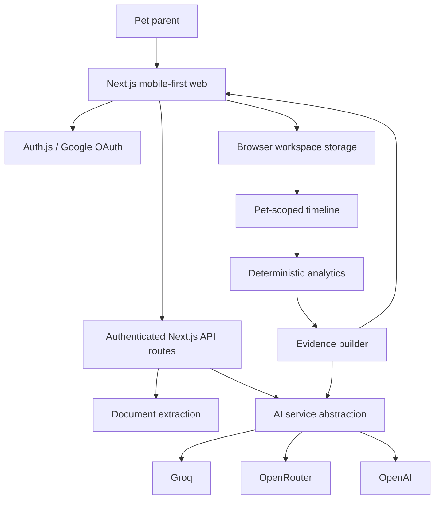
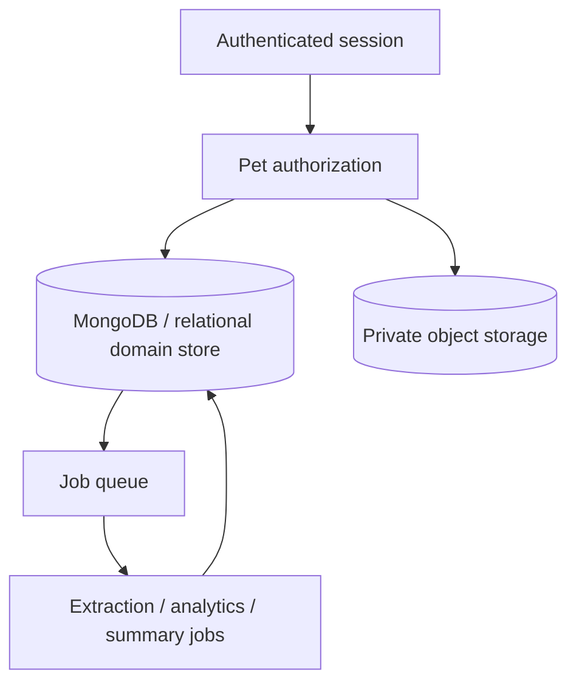
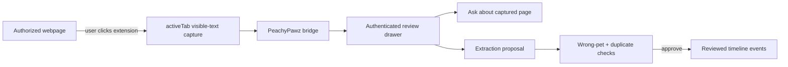

# Technical Architecture

## MVP topology



## Why one Next.js application

For this MVP, a modular monolith is preferable to microservices:

- one deployable unit
- simple authentication boundary
- fewer network failure modes
- domain logic remains easy to inspect
- sufficient for code-a-thon scale

The architecture separates modules by responsibility without pretending they need independent infrastructure yet.

## Client domain flow

```text
reviewed HealthEvent[]
     ↓ petId filter
pet timeline
     ↓
analyzePet()
     ↓
AnalyticsResult
     ├─ changes
     ├─ baselines
     ├─ primary insight
     └─ evidence IDs
```

Home/Insights render deterministic results immediately. AI is requested only for explicit narrative/chat/document actions.

## Authentication

`src/auth.ts` configures Auth.js Google OAuth.

Server endpoints check the authenticated session before AI or extraction work.

Prototype local data is keyed to the signed-in account. Production must not rely on that client key as authorization; the backend must validate owner/membership + pet on every operation.

## Workspace persistence

### Prototype

```text
Google user ID
  ↓
localStorage workspace key
  ├─ pets
  ├─ events
  ├─ selected pet
  └─ AI consent

per user + pet chat key
  └─ recent conversation turns
```

This makes the evaluator path resilient but does not provide cross-device durability.

### Production



## Data modules

- `types.ts` — domain contracts
- `units.ts` — canonical unit normalization
- `analytics.ts` — deterministic longitudinal analytics
- `document-extraction.ts` — structured extraction schema + heuristic parsing
- `ai/provider.ts` — provider abstraction
- `ai/service.ts` — story/chat/retrieval orchestration
- `ai/safety.ts` — output/urgent-language guardrails
- `seed.ts` — explicit synthetic evaluator data only

## Document pipeline

```text
file
 ↓
size/type validation
 ↓
SHA-256 exact duplicate fingerprint
 ↓
PDF/TXT text extraction or optional vision extraction
 ↓
structured proposal (Zod validated)
 ↓
wrong-pet / confidence warnings
 ↓
user review
 ↓ approve
structured event(s) + document-memory event
 ↓
timeline analytics recompute
```

The source document text cannot issue instructions to the model; it is data inside a bounded extraction context.

## Weight-unit normalization

The timeline can retain source units, but analytics converts weight into canonical kilograms before baseline or percentage comparison.

```text
18 kg → 18 kg
40 lb → 18.14 kg
```

This avoids unit-induced false trends.

## Record mutation / insight freshness

Insights are calculated from the current timeline rather than treated as permanent model output.

```text
record correction/deletion
   ↓
React state changes
   ↓
analyzePet(current events)
   ↓
new evidence + new insight
```

Production should add explicit insight records with data-version hashes and `stale/superseded` lifecycle states.

## Conversational retrieval

The chat input is first routed into:

- conversation
- general information
- pet-record question/follow-up

For pet-record questions:

```text
question
 + recent conversation
 + relevant older conversation
 + relevant current pet events/documents
 → AI service
 → evidence validation
 → answer
```

Conversation history can clarify “that report” but cannot prove a health claim.

## API surface

### `/api/ai`

Authenticated operations for story/chat where configured.

### `/api/documents/extract`

Authenticated upload/extraction endpoint with bounded inputs.

### `/api/auth/[...nextauth]`

Auth.js OAuth endpoints.

## Scaling path

Do not prematurely split microservices. Introduce infrastructure when workload requires it:

1. database/object storage
2. queue for extraction and regeneration
3. notification service
4. connector/import workers
5. hybrid retrieval index
6. analytics observability

Domain APIs can later separate into Pet, Records, Documents, Analytics, AI and Notification services while preserving the same event/evidence contracts.


## Browser companion ingestion (bonus)



The extension never becomes a trusted source automatically. Captured content is untrusted until reviewed, and a captured-page Q&A response is visually distinguished from verified pet-record answers. See `docs/BROWSER_EXTENSION.md`.
